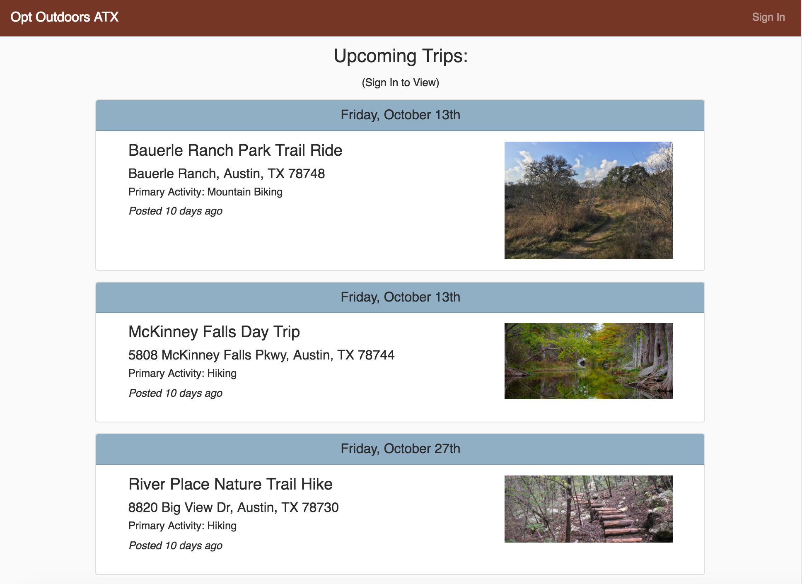

# Opt Outdoors ATX

## Description

Single page web application for outdoor enthusiasts to organize and join activities in the Austin area. The goal of this project was to build a fully functioning CRUD (create, read, update, delete) application using React for the frontend framework. This application was built over two weeks and was also my first experience using React.

## Technologies Used

* [React](https://reactjs.org/) - Front-end web framework
* [Node.js](https://nodejs.org/en/) - Server-side scripting
* [Express](https://expressjs.com/) - Web application framework for Node.js
* [PostrgeSQL](https://www.postgresql.org/) - Relational database
* [Bootstrap](http://getbootstrap.com/) - Web app styling
* [Heroku](https://www.heroku.com/) - Web app deployment

## Deployed Site

https://opt-outdoors-atx.herokuapp.com

## Views

### Landing Page

Users can only browse basic information on upcoming events unless they are signed in.

### Login Page

New users will need to register by providing their name, email and a password. Returning users can log in using their email and password.

### Event Pages

Once users have successfully logged in they can see additional information on each upcoming event. Here users can also join the event, contact the organizer or leave a public comment.

### Add Event Page

Users can post a new event by providing event details such as location, date, description, image, etc. All fields must be completed before an event is added to the database and displayed.

### Manage Events

Users have the ability to manage which events they are attending and which events they have organized. There are separate views for events the user is attending and events the user is hosting.

